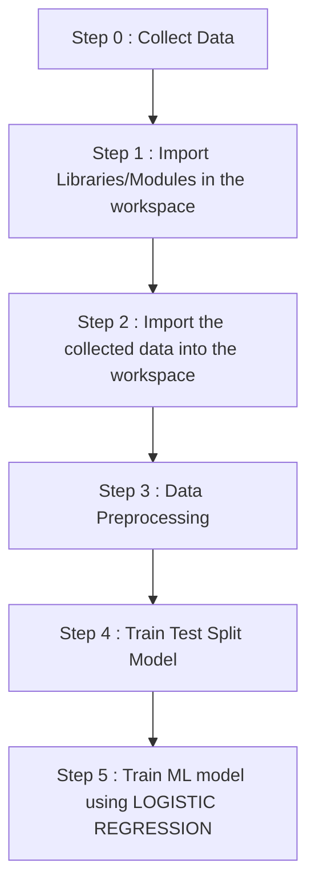

# Credit_Card_Transaction_Fraud_Detection
This is a supervised machine learning project to detect whether a credit card transaction is legit or fraud.

### Dataset Link : https://www.kaggle.com/datasets/mlg-ulb/creditcardfraud

